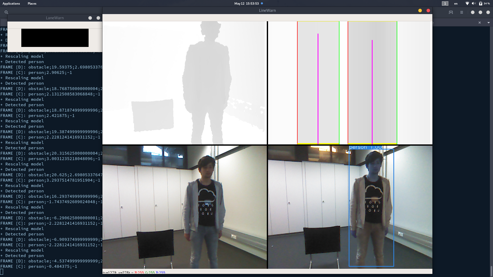
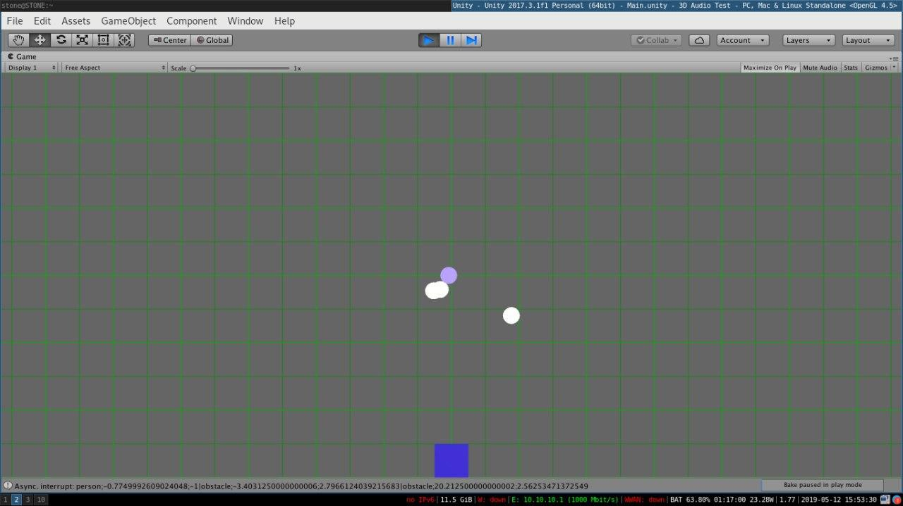

# LaneWarn
Colission avoidance for visually impaired people using IR and machine learning

Note: hey! we are lanewarn - our goal was to create a colission avoidance system for visually impaired people using IR and machine learning. Our motivation was the following:

---

# Motivation

Note: while most of the world is moving towards autonomous driving, a lot of visually impaired people are still relying on basic means for navigation through their surroundings - so we had an idea

---

# Idea!

Note: colission avoidance techniques such as LIDAR, RADAR, IR or ultrasonic have made great leaps of improvement in recent years and could be used to aid visually impaired people. Measurements from such devices can provided to the user using sound or tactical feedback - so we built a prototype!

---

# Prototype

Note: using a simple RGB camera and the IR sensor from our off-the-shelf XBOX Kinect we were able to predict obstacles in three-dimensional space **reliably** with additional context from our neural network. Using machine learning we can classify and categorize possible hazards in their environment and warn the user in advance. Our rough prototype already provided enough information to navigate through a variety of environments. People were able to find obstacles in their surroundings using nothing but audio feedback within seconds. Now I would like to show you a few screenshots

---

Note: this portrays a sample scene - you can see the depth analysis on top and the machine learning classification on the bottom

---

Note: and this is our sound application